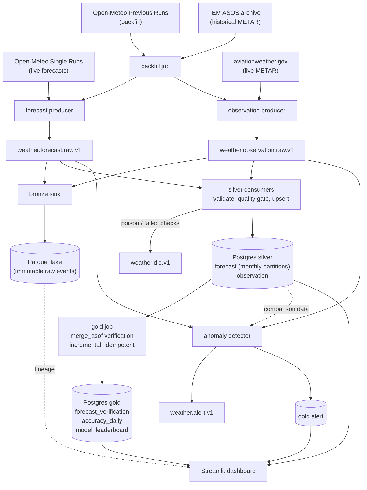

# Nimbus

**Which weather forecast should you trust, where, and how far ahead?**

Nimbus is a streaming data platform that collects forecasts from three global weather models and real observations from airport weather stations, scores every forecast against what actually happened, and ranks the models by location, variable and lead time. It is built on Kafka, Python, pandas and Postgres, with data-quality gates, lineage tracing, streaming anomaly alerts and a Streamlit dashboard.

Everything is free and self-hosted: the three data sources are free, keyless APIs and every service runs locally in Docker. Grounded LLM briefings are built and tested; an AI agent is planned. The platform runs without an Anthropic API key (`LLM_ENABLED=false` is the default) - the only component that can ever cost money is the optional Claude API, and it stays off until you add a key.

> **Status:** Phases 0-4 are implemented and were run against the live providers: ingestion, silver, backfill and replay, the gold layer and data quality, the anomaly detector and dashboard v1. Phase 5 (grounded LLM briefings) is implemented and tested with a deterministic fake client; **no call has been made to the real Claude API** - the project deliberately runs at $0, so the LLM stays off. The agent (Phase 6), orchestration (Phase 7) and polish (Phase 8) are not started. Progress: [`docs/PLAN.md`](docs/PLAN.md). Want to show it to someone? [`docs/demo.md`](docs/demo.md) is a 5-minute script.

## What it found on real data

Measured on the live APIs, from a clean checkout on a GitHub runner (30 days, 25 locations, 3 models):

| | |
|---|---|
| Data loaded | 1,512,000 forecast rows + 108,396 observation rows; a separate 4-month run loaded 6,048,000 + 435,832. Reconciliation matched on both topics |
| Forecasts verified | 1,430,440 of 1,440,000 eligible values found an observation within 30 minutes (99.3%) |
| Error vs lead time | Rises with lead time for every variable. Temperature MAE 1.44 K at day 1 to 2.16 K at day 7 (dew point, wind and pressure also rise) |
| Model ranking | For day-1 temperature that month: ICON 1.27 K, ECMWF 1.51 K, GFS 1.55 K. One window, not a general ranking |
| Idempotency | A checksum of both gold tables (including compute timestamps) was identical before and after an incremental and a full re-run |
| Quality gate | 3 of 27,102 observation messages quarantined - one traced to a METAR the provider itself truncated mid-report |
| Alerts | One live cycle raised 12 alerts, all published. All seven pressure alerts were at high-elevation stations and exposed a real bug (altimeter setting used as sea-level pressure), now fixed - see [ADR 0006](docs/decisions/0006-phase4-anomaly-detector.md) |
| Speed | Silver load about 4,400 rows/s with the quality gate on (1.5M rows in 5 m 45 s); gold build about 15 s per day |

Details, caveats and what was *not* measured are in [ADR 0004](docs/decisions/0004-backfill-replay-reconciliation.md) and [ADR 0005](docs/decisions/0005-phase3-gold-quality-lineage.md).

## Architecture



The Parquet lake is the source of truth for replay: silver can be rebuilt from it, and `make reconcile` proves silver equals such a rebuild. Design rationale for each stage is in [`docs/decisions/`](docs/decisions/).

## Quickstart

Prerequisites: [Docker Desktop](https://www.docker.com/products/docker-desktop/) (WSL2 backend on Windows) and [uv](https://docs.astral.sh/uv/).

```bash
cp .env.example .env
uv sync --extra ingestion --extra dashboard   # Python dependencies
make up          # Kafka (KRaft), Kafbat UI (localhost:8080), Postgres; runs migrations, creates topics
make demo        # last 30 days for 25 locations -> bronze, silver, reconcile, gold, quality checks
make dashboard   # http://localhost:8501
```

`make demo` calls the real Open-Meteo, aviationweather.gov and IEM APIs. About 30 days costs roughly 450 of Open-Meteo's 10,000 free daily calls; a full history since 2024-01-01 (`make backfill`) spans two days of budget.

Then look at the results:

```bash
docker exec nimbus-postgres psql -U nimbus -d nimbus -c \
  "select lead_day, round(avg(mae)::numeric, 2) as mae from gold.accuracy_daily
   where variable = 'temperature_2m' group by 1 order by 1"
```

### Commands

```bash
make up / down / logs        # the Docker stack
make demo / backfill         # load 30 days / the full history
make drain                   # run the consumers until caught up, then exit
make reconcile               # produced -> bronze -> silver check
make gold                    # verification + accuracy + leaderboard (incremental; ARGS=--full)
make quality                 # pandera checks over changed rows + freshness
make trace SAMPLE=forecast   # follow one event bronze -> silver -> gold (or EVENT_ID=...)
make alerts                  # anomaly detector (live events -> weather.alert.v1)
make partitions              # create upcoming monthly partitions; apply retention
make dashboard               # Streamlit dashboard
make briefings               # daily LLM briefings (off unless LLM_ENABLED=true; ARGS=--dry-run prints fact sheets)
make briefing-consumer       # a briefing when an alert arrives
make replay ARGS=...         # rebuild silver from the lake, or reset a consumer group
make produce-forecasts       # live producers (ARGS=--once for a single cycle)
make produce-observations
make test / test-integration # unit tests / Testcontainers tests (Kafka + Postgres)
make lint / typecheck
```

Operational procedures (crashed consumer, rebuilding from bronze, the DLQ, rate limits, the detector, partitions): [`docs/runbook.md`](docs/runbook.md).

## How it works

**Ingest.** Idempotent producers (`acks=all`, deterministic event ids) publish raw API responses to Kafka. Forecast backfill uses Open-Meteo's Previous Runs API, whose fixed lead offsets mean `init_time` is derived (`valid_time - N days`) and flagged `ingestion_mode='backfill'`, so live and historical data share one table and one consumer.

**Bronze and silver.** The bronze sink writes each micro-batch untouched to a Parquet file with its Kafka partition and offset. Silver consumers validate every event (Pydantic), run a batch-level pandera gate, and upsert into Postgres on natural keys, committing offsets only after the write. A message that fails a blocking check goes to the dead-letter queue and never blocks the partition.

**Gold.** For each UTC valid date the job matches every forecast value to the nearest observation of the same station and variable within 30 minutes (`pandas.merge_asof`), computes error = forecast - observed, and aggregates count, bias, MAE and RMSE per date, location, model, variable and lead day. It is *incremental* (a watermark on `updated_at`, which only moves when a value really changes) and *idempotent* (a day is synced, not appended, so a re-run leaves every row untouched). The 7- and 30-day leaderboard is a SQL view that combines daily rows exactly, weighted by count.

**Data quality.** Each table has a *blocking* schema (structure, physically impossible values) and a *warning* schema (unusual but plausible values). Blocking failures quarantine the message in silver and abort the day in gold; warnings load and are flagged. Every result lands in `ops.quality_results`, alongside freshness checks per station and per source.

**Lineage.** `make trace` (and the dashboard's Lineage page) follows one event from the API request to its Kafka partition and offset, its bronze file, its silver rows, and the gold metrics it fed, matching by natural key so an event that a later one overwrote is still found.

**Alerts.** The anomaly detector consumes live events and raises alerts when a new model run moves a location's next-48-hour forecast, when models disagree, or when an observation misses the forecast. It keeps no state in memory (comparison data is read from silver), alert ids are deterministic, and delivery is insert-then-publish, so a restart or replay neither loses nor duplicates an alert. See [ADR 0006](docs/decisions/0006-phase4-anomaly-detector.md), including how Kafka Streams or Flink would hold this state at scale.

**Briefings.** Code builds a fact sheet per location - each model's next-48-hour outlook, how much the models disagree, their recent accuracy there, active alerts, and a confidence level decided from model agreement. Claude (Haiku 4.5) writes a short briefing from that sheet alone as validated structured output, retried once if invalid. An automatic grounding check then requires every number to appear in, or round from, the fact sheet; a briefing that fails is stored flagged and never published. Identical fact sheets never pay twice (cached by hash), and every call is logged with tokens, latency and estimated cost ([ADR 0008](docs/decisions/0008-phase5-grounded-briefings.md)).

**Dashboard.** Six pages: Pipeline Health (throughput, consumer lag, dead letters, freshness, quality, reconciliation, alerts), Forecast vs Actual, Accuracy (leaderboard, error vs lead time, best model by location), Lineage, Briefings and LLM Usage. Pages are thin; the logic lives in a tested query layer ([ADR 0007](docs/decisions/0007-phase4-dashboard.md)).

## Design decisions

| Decision | Why | ADR |
|---|---|---|
| Kafka in KRaft mode, bronze Parquet lake as the replay source | Kafka retention is short; the lake makes silver rebuildable and reconciliation meaningful | [0001](docs/decisions/0001-initial-architecture-verification.md), [0004](docs/decisions/0004-backfill-replay-reconciliation.md) |
| Reconciliation as "rebuild equivalence" | Comparing produced vs consumed counts fails when identical events are legitimately re-produced; replaying the lake and diffing natural keys does not | [0004](docs/decisions/0004-backfill-replay-reconciliation.md) |
| `updated_at` bumped only on real change | Gives incremental jobs a change signal that means something, and makes redelivery a no-op | [0005](docs/decisions/0005-phase3-gold-quality-lineage.md) |
| Two range tiers (plausible vs hard limit) | Unusual weather is real and must not be discarded; 500 K is a unit bug | [0005](docs/decisions/0005-phase3-gold-quality-lineage.md) |
| Monthly partitions on `valid_time`, retention off by default | Gold and retention both work a date at a time; the demo dataset is the full history | [0005](docs/decisions/0005-phase3-gold-quality-lineage.md) |
| Stateless detector reading silver | A restart loses nothing; no changelog to maintain at this scale | [0006](docs/decisions/0006-phase4-anomaly-detector.md) |
| LLM sees only a code-built fact sheet; numbers checked after | An LLM that computes nothing can be checked; confidence is decided by code, explained by the model | [0008](docs/decisions/0008-phase5-grounded-briefings.md) |

## Engineering standards

Python 3.12+, full type hints, ruff and mypy in strict mode, pre-commit hooks, Conventional Commits. Unit tests need no external services; integration tests run real Kafka and Postgres through Testcontainers. GitHub Actions runs lint, typecheck, unit and integration tests on every push. A manually triggered workflow (`live-demo.yml`) runs the quickstart from a clean checkout against the real providers and writes the evidence to its job summary. Tests never call live APIs or a real LLM, and pipeline code contains no fake data - recorded fixtures exist only under `tests/`.

## Limitations

- **One month of ranking is not a verdict.** The model leaderboard reflects a single 30-day window.
- **Forecast lead is day-granular** for backfilled data (the Previous Runs API offers whole-day offsets).
- **Pressure is not verified at high-elevation stations without SLP** (Bogota, Mexico City, Kathmandu and similar): the altimeter setting is not sea-level pressure there, so it is left missing rather than wrong.
- **Anomaly thresholds are untuned.** They were set relative to measured forecast error, not to a measured alert rate, which needs weeks of live data.
- **A full-history gold build is extrapolated, not measured** (about 15 s per day suggests roughly four hours for ~1,000 days). The full `make backfill` has not been run.
- **The dashboard has been rendered headlessly - including on the real data - but not reviewed in a browser**, and has no screenshots yet.
- **Quarantine is per message**, so one bad value drops that report's other valid variables (3 of 27,102 messages in the 30-day run).
- **LLM briefings have not run against the real API** - only against a deterministic fake client and stubbed SDK replies, because the project is kept at $0 by choice. The grounding check catches invented numbers, not numbers used for the wrong thing, and misses numbers written as words.
- Single-broker Kafka and a single Postgres: a laptop-scale design. At 1000x scale this would move to Flink or Kafka Streams, Spark, Iceberg, Schema Registry, managed Kafka and a cloud warehouse.

## Data sources and attribution

- Forecasts: [Open-Meteo](https://open-meteo.com/) (Single Runs and Previous Runs APIs; CC BY 4.0, non-commercial use, no key).
- Live observations: [aviationweather.gov](https://aviationweather.gov/data/api/) METAR Data API.
- Historical observations: [Iowa Environmental Mesonet](https://mesonet.agron.iastate.edu/ASOS/) ASOS archive.

## Documentation

[`docs/PROJECT_BRIEF.md`](docs/PROJECT_BRIEF.md) (requirements) - [`docs/PLAN.md`](docs/PLAN.md) (phase checklist) - [`docs/decisions/`](docs/decisions/) (ADRs) - [`docs/runbook.md`](docs/runbook.md) (operations) - [`docs/interview-notes.md`](docs/interview-notes.md) (talking points)

Nimbus is an analytics and portfolio project, not a safety tool. For weather warnings, use official weather services.
