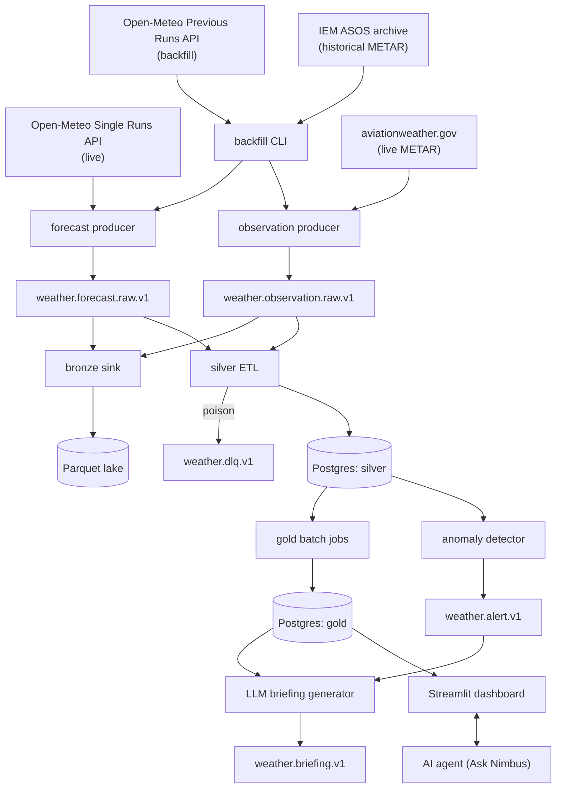

# Nimbus

A streaming weather-forecast accuracy platform: it continuously collects forecasts from several global weather models and real observations from weather stations, then measures how accurate each model is by location, variable, and lead time — *which forecast should I trust, where, and how far ahead?* Built with Kafka, Python, pandas, and Postgres, with grounded LLM briefings and an AI agent on top.

Runs entirely free and self-hosted: every data source (Open-Meteo, aviationweather.gov, IEM ASOS) is a free, no-key API, and every service (Kafka, Postgres, Streamlit, Airflow) is open source and runs locally in Docker. The only component that can ever cost money is the optional Anthropic API for the LLM briefings/agent phases, which stays off (`LLM_ENABLED=false`) unless you deliberately add a key.

Full requirements: [`docs/PROJECT_BRIEF.md`](docs/PROJECT_BRIEF.md). Phase-by-phase progress: [`docs/PLAN.md`](docs/PLAN.md). Design decisions: [`docs/decisions/`](docs/decisions/).

**Status: Phase 0 (foundation) in progress.** The commands below reflect what actually works today; later phases will fill in `make demo`, `make backfill`, `make eval`, `make trace`, and `make replay`.

## Architecture



Full diagram and rationale: [`docs/decisions/0001-initial-architecture-verification.md`](docs/decisions/0001-initial-architecture-verification.md).

## Quickstart

Prerequisites: [Docker Desktop](https://www.docker.com/products/docker-desktop/) with the WSL2 backend (Windows), [uv](https://docs.astral.sh/uv/).

```bash
cp .env.example .env
make up      # starts Kafka (KRaft), Kafbat UI (localhost:8080), and Postgres
uv sync      # installs Python dependencies
make test    # unit tests
make lint
make typecheck
```

`make demo` (a short backfill + populated dashboard) and `make backfill` (full history) land in Phase 1-2. `make eval`, `make trace`, and `make replay` land in Phases 3 and 6.

## Tech stack

Python 3.12+, Apache Kafka (KRaft mode), pandas, PostgreSQL, Docker Compose, and the Anthropic Claude API (optional). Full list and version-pinning rationale in [`pyproject.toml`](pyproject.toml) and ADR 0001.

## Out of scope

User accounts and authentication, mobile apps, public hosting, paid data sources, and severe-weather warnings. Nimbus is an analytics/portfolio project, not a safety tool — for weather warnings, use official weather services.
