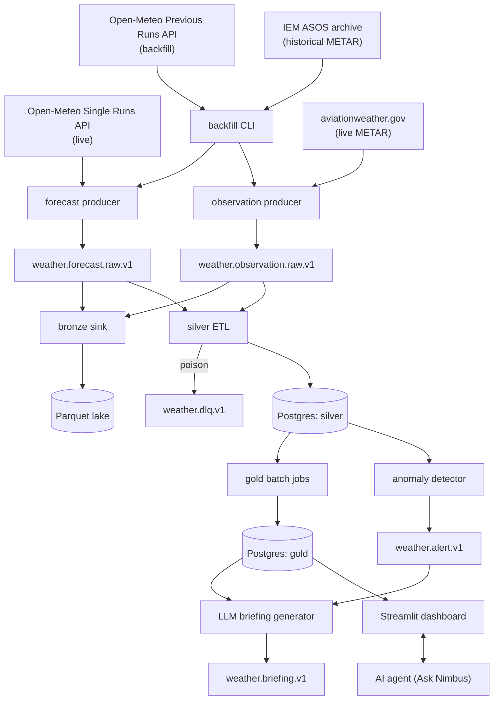

# Nimbus

A streaming weather-forecast accuracy platform: it continuously collects forecasts from several global weather models and real observations from weather stations, then measures how accurate each model is by location, variable, and lead time — *which forecast should I trust, where, and how far ahead?* Built with Kafka, Python, pandas, and Postgres, with grounded LLM briefings and an AI agent on top.

Runs entirely free and self-hosted: every data source (Open-Meteo, aviationweather.gov, IEM ASOS) is a free, no-key API, and every service (Kafka, Postgres, Streamlit, Airflow) is open source and runs locally in Docker. The only component that can ever cost money is the optional Anthropic API for the LLM briefings/agent phases, which stays off (`LLM_ENABLED=false`) unless you deliberately add a key.

Full requirements: [`docs/PROJECT_BRIEF.md`](docs/PROJECT_BRIEF.md). Phase-by-phase progress: [`docs/PLAN.md`](docs/PLAN.md). Design decisions: [`docs/decisions/`](docs/decisions/).

**Status: Phase 3 (gold layer and data quality) implemented; Phases 0-2 run against the live providers for four months.** Live forecasts and METAR observations flow through Kafka into a Parquet bronze lake and validated, idempotent Postgres silver tables for 25 locations. Historical forecasts (Open-Meteo Previous Runs) and observations (IEM ASOS) load through the same topics, and silver can be rebuilt from the lake — see [`docs/runbook.md`](docs/runbook.md). `make demo` has been run from a clean checkout on a GitHub runner for 120 days: 6,048,000 forecast and 435,832 observation rows across 25 locations, reconciled with `MATCH` (details and timings in [ADR 0004](docs/decisions/0004-backfill-replay-reconciliation.md)). The full history via `make backfill` has not been run. On top of silver, `make gold` scores every forecast against the nearest observation (`merge_asof`) into incremental, idempotent gold tables and a model leaderboard; pandera checks gate every load (`make quality`), `make trace` follows one event from API request to gold metric, and `silver.forecast` is partitioned monthly - see [ADR 0005](docs/decisions/0005-phase3-gold-quality-lineage.md). The dashboard, briefings and the agent come in later phases.

## Architecture



Full diagram and rationale: [`docs/decisions/0001-initial-architecture-verification.md`](docs/decisions/0001-initial-architecture-verification.md).

## Quickstart

Prerequisites: [Docker Desktop](https://www.docker.com/products/docker-desktop/) with the WSL2 backend (Windows), [uv](https://docs.astral.sh/uv/).

```bash
cp .env.example .env
uv sync --extra ingestion   # Python dependencies (+ pyarrow for the bronze lake)
make up                     # Kafka (KRaft), Kafbat UI (localhost:8080), Postgres;
                            # also runs migrations and provisions topics
make demo                   # last 30 days for all 25 locations -> bronze + silver, then reconciles
```

Then look at the data:

```bash
docker exec nimbus-postgres psql -U nimbus -d nimbus -c "select ingestion_mode, count(*) from silver.forecast group by 1"
```

Other targets:

```bash
make backfill               # everything since 2024-01-01 (needs two days of API budget)
make drain                  # run the consumers until caught up, then exit
make reconcile              # produced -> bronze -> silver check
make gold                   # verification + accuracy + leaderboard (incremental, idempotent)
make quality                # pandera checks + freshness -> ops.quality_results
make trace SAMPLE=forecast  # follow one event bronze -> silver -> gold (or EVENT_ID=...)
make partitions             # create upcoming monthly silver.forecast partitions
make produce-forecasts      # live forecast producer (Ctrl+C to stop)
make produce-observations   # live METAR producer (Ctrl+C to stop)
make test                   # unit tests
make test-integration       # real Kafka + Postgres via Testcontainers
make lint && make typecheck
```

`make eval` lands in Phase 6. Operational procedures (recovering a crashed consumer, rebuilding silver from bronze, the DLQ, rate limits) are in [`docs/runbook.md`](docs/runbook.md).

## Data sources and attribution

- Forecasts: [Open-Meteo](https://open-meteo.com/) (Single Runs and Previous Runs APIs; CC BY 4.0, non-commercial use, no key).
- Live observations: [aviationweather.gov](https://aviationweather.gov/data/api/) METAR Data API.
- Historical observations: [Iowa Environmental Mesonet](https://mesonet.agron.iastate.edu/ASOS/) ASOS archive.

## Tech stack

Python 3.12+, Apache Kafka (KRaft mode), pandas, PostgreSQL, Docker Compose, and the Anthropic Claude API (optional). Full list and version-pinning rationale in [`pyproject.toml`](pyproject.toml) and ADR 0001.

## Out of scope

User accounts and authentication, mobile apps, public hosting, paid data sources, and severe-weather warnings. Nimbus is an analytics/portfolio project, not a safety tool — for weather warnings, use official weather services.
